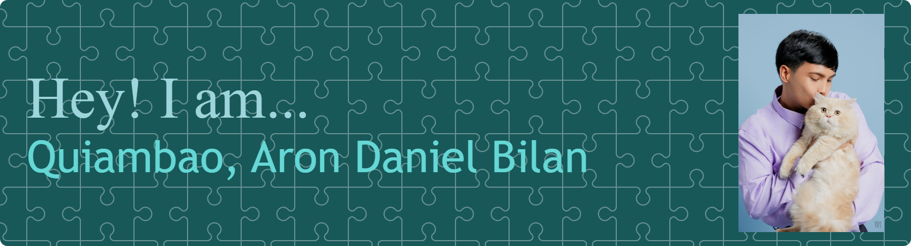
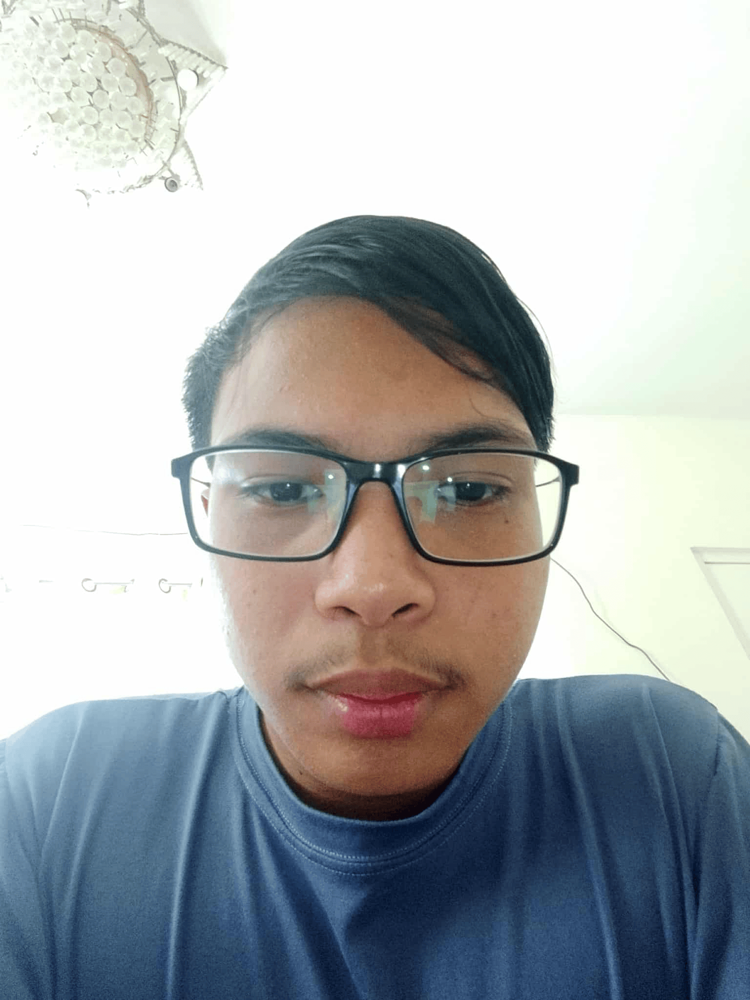

<!-- Banner -->

  

---

## 👋 ABOUT ME

  

Hi! I'm **Aron Daniel B. Quiambao**, a chill developer, laid back but still competitive programer who is passionate on learning new technologies.  
I enjoy discovery something new, trying something new and changing for the new.

---

## 🎯 AREA OF INTEREST
- 💻 Code Programming  
- 🌐 Webpage Programming  
- 🤖 Artificial Intelligence & Automation  

**Languages I use:**  
`C` | `Java` | `Python`

---

## 🐾 PROJECT LINKS
Here are my Midterm Lab Tasks:

- **[Midterms Lab Task 1](https://aronquiambao.github.io/Midterm-Lab-Task-1/)**
- **[Midterms Lab Task 2](https://aronquiambao.github.io/Midterm-Lab-Task-2/)**
- **[Midterms Lab Task 3](https://aronquiambao.github.io/Midterm-Lab-Task-3/)**
- **[Midterms Lab Task 4](https://aronquiambao.github.io/Midterm-Lab-Task-4/)**
- **[Midterms Lab Task 5](https://aronquiambao.github.io/Midterm-Lab-Task-5/)**
- **[Midterms Lab Task 6](https://aronquiambao.github.io/Midterm-Lab-Task-6/)**

---

And here is a cat that I found outside:  

  

---

## 😄 FUN FACTS ABOUT ME
- I love drinking coffee ☕😋  
- I treat Gacha Games as my routine 🎮🎲  
- I talk to my pets as if they’re teammates 🐶🐱  

---

## 📬 CONTACTS

-  [Facebook](https://www.facebook.com/aron.daniel.quiambao)  
-  [Instagram](https://www.instagram.com/arondanielquiambao)  
-  [LinkedIn](https://www.linkedin.com/in/aron-quiambao-5938352a2)  
